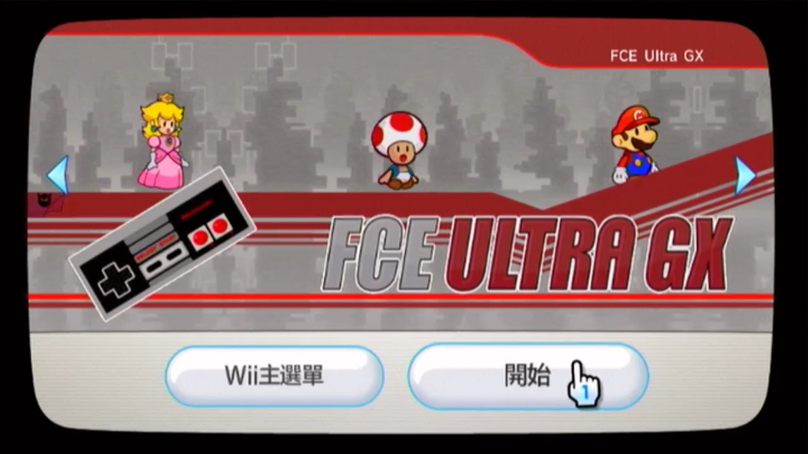

# FCEUltraGX 中文版简介

FCEUltraGX 是 Wii 上面著名的红白机模拟器，[官方版本](http://wiibrew.org/wiki/FCE_Ultra_GX)为英文，本分支为其中文版的开发分支。

> 中文版下载页面：<https://github.com/duxiuxing/fceugx-cn/releases>

以下是对下载页面中的三个压缩包的简单说明：

## 1. FCEUltraGX-CN.zip

打包的是模拟器的中文版，与中文完整版择一下载即可

## 2. FCEUltraGX-CN-Full.zip

打包的是模拟器的中文完整版，在设定菜单可切换不同的语言，由于打包了外语字库，所以总的文件体积会略大一些

目前支持的语言有：

| 序号 | 语言 | 序号 | 语言 |
| ---: | --- | ---: | --- |
| 1 | 日本语 | 2 | 英语 |
| 3 | 德语 | 4 | 法语 |
| 5 | 西班牙语 | 6 | 意大利语 |
| 7 | 荷兰语 | 8 | 简体中文 |
| 9 | 韩国语 | 10 | 葡萄牙语 |
| 11 | 巴西葡萄牙语 | 12 | 加泰罗尼亚语 |
| 13 | 土耳其语 | | |

## 3. FCEUltraGX-Channel-Installer.zip

会在系统桌面安装一个Wii频道，打开频道就可以打开模拟器，见系统桌面第二行的第一个频道

