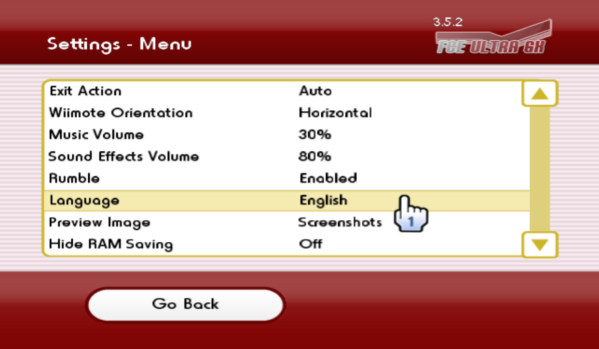

# 关于官方版本和简体中文版本的说明

## 1. 官方版本

相关链接：
- 下载：<https://github.com/dborth/fceugx/releases>
- 开源项目：<https://github.com/dborth/fceugx>

### 1.1 支持多语种

官方版本支持在 Settings - Menu 界面设定 APP 的显示语言，目前支持的语种有：

| 名称 | 枚举值 |
| --- | --- |
| 日本语 | LANG_JAPANESE |
| 英语 | LANG_ENGLISH |
| 德语 | LANG_GERMAN |
| 法语 | LANG_FRENCH |
| 西班牙语 | LANG_SPANISH |
| 意大利语 | LANG_ITALIAN |
| 荷兰语 | LANG_DUTCH |
| 简体中文 | LANG_SIMP_CHINESE |
| 韩国语 | LANG_KOREAN |
| 葡萄牙语 | LANG_PORTUGUESE |
| 巴西葡萄牙语 | LANG_BRAZILIAN_PORTUGUESE |
| 加泰罗尼亚语 | LANG_CATALAN |
| 土耳其语 | LANG_TURKISH |

### 1.2 各语种对应的字体（`.ttf`）文件说明

字体文件存放在项目的 `fonts` 文件夹，各语种和字体文件的对应关系如下：
| 语种 | 字体文件 |
| --- | --- |
| 简体中文 | zh.ttf |
| 日本语 | jp.ttf |
| 韩国语 | ko.ttf |
| 其他语种 | en.ttf |

- 默认字体文件，位于项目的 `source\fonts\font.ttf`。启动编译之后，编译器会根据这个路径找到 `font.ttf`，并把它作为内部资源，合并到最后编译生成的 `.dol` 文件中；

- `master` 分支上的默认字体文件对应的是英语，所以在创建好 `develop` 分支之后，原来的默认字体文件 `source\fonts\font.ttf` 被转存到了 `fonts\en.ttf`；

- `develop` 分支上的默认语种是简体中文，所以 `develop` 分支上的默认字体文件 `source\fonts\font.ttf` 已经被换成了 `fonts\zh.ttf`；

- 非默认语种对应的字体文件，在编译成功之后，需要和编译生成的 `.dol` 文件拷贝到同一个文件夹下进行打包发布。

### 1.3 Bug

官方版本是支持多语种切换的，但是在打包发布的时候，没有在 `apps\fceugx` 文件夹下拷贝非默认语种对应的字体文件，所以在设定中日韩三国语言的时候会报错：

把项目 `source\fonts` 文件夹下的字体文件拷贝到 `apps\fceugx` 文件夹下，即可修复这个 Bug。

## 2. 中文版本

- 开源项目：<https://github.com/duxiuxing/fceugx-cn>
- `master` 分支：用来同步官方版本的修改，以及向官方版本提交 Bugfix；
- `develop` 分支：中文版本开发分支，会定期从 `master` 分支同步官方版本的修改；
- `cn-only` 分支：中文版本开发分支，会定期从 `develop` 分支同步代码，但顾名思义，这条分支上的版本不支持多语种切换。

### 2.1 `develop` 分支说明

- 基于 `master` 分支创建；
- 默认语种改成了简体中文；
- 调整了实现部分的代码，可以快速地从多语种版本切换到单一语种版本；
- 这个分支的 Build 脚本（`workflows\build.yml`），目前的主要任务可以理解成是输出一个默认语种为简体中文的官方版本。

### 2.1 `cn-only` 分支说明

- 基于 `develop` 分支创建；
- 屏蔽了对多语种的支持，因此打包体积会比较小；
- 这个分支的 Build 脚本（`workflows\build.yml`），目前的主要任务可以理解成是输出一个默认语种为简体中文，且不支持多语种切换的官方版本。
