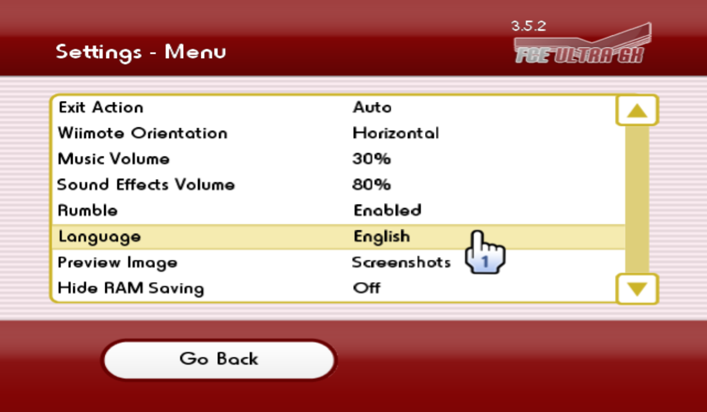

# 官方版本 vs. 中文版本

## 1. 官方版本

相关链接：
- 下载：<https://github.com/dborth/fceugx/releases>
- 开源项目：<https://github.com/dborth/fceugx>

### 1.1 支持多语种

官方版本支持在 Settings - Menu 界面设定 APP 的显示语言，目前支持的语种有：

| 名称 | 枚举值 |
| --- | --- |
| 日本语 | LANG_JAPANESE |
| 英语 | LANG_ENGLISH |
| 德语 | LANG_GERMAN |
| 法语 | LANG_FRENCH |
| 西班牙语 | LANG_SPANISH |
| 意大利语 | LANG_ITALIAN |
| 荷兰语 | LANG_DUTCH |
| 简体中文 | LANG_SIMP_CHINESE |
| 韩国语 | LANG_KOREAN |
| 葡萄牙语 | LANG_PORTUGUESE |
| 巴西葡萄牙语 | LANG_BRAZILIAN_PORTUGUESE |
| 加泰罗尼亚语 | LANG_CATALAN |
| 土耳其语 | LANG_TURKISH |

### 1.2 各语种对应的字体（`.ttf`）文件说明

字体文件存放在项目的 `fonts` 文件夹，各语种和字体文件的对应关系如下：
| 语种 | 字体文件 |
| --- | --- |
| 简体中文 | zh.ttf |
| 日本语 | jp.ttf |
| 韩国语 | ko.ttf |
| 其他语种 | en.ttf |

- 默认字体文件，位于项目的 `source\fonts\font.ttf`。启动编译之后，编译器会根据这个路径找到 `font.ttf`，并把它作为内部资源，合并到最后编译生成的 `.dol` 文件中；

- 中文版本各个分支的默认语种都是简体中文，所以默认字体文件 `source\fonts\font.ttf` 使用 `fonts\zh.ttf` 进行了替换；

- 官方版本使用的默认字体文件另存为 `fonts\en.ttf`；

- 非默认语种对应的字体文件，在编译成功之后，需要和编译生成的 `.dol` 文件拷贝到同一个文件夹下进行打包发布。

### 1.3 Bug

官方版本是支持多语种切换的，但是在发布的时候，没有在 `apps\fceugx` 文件夹下打包非默认语种对应的字体文件，所以官方版本在设定中日韩三国语言的时候会报错：

把项目 `source\fonts` 文件夹下的字体文件拷贝到 `apps\fceugx` 文件夹下，即可修复这个 Bug。

## 2. 中文版本

> 开源项目：<https://github.com/duxiuxing/fceugx-cn>

### 2.1 `master` 分支说明

- 中文完整版的开发分支，会定期同步官方版本的修改；
- 这条分支编译的版本可以理解成是：默认语种为简体中文的官方版本，支持多语种切换；
- 调整了实现部分的代码，在代码层级，可以更快地在多语种版本和单一语种版本之间切换。

### 2.1 `cn-only` 分支说明

- 中文版的开发分支，基于 `master` 分支创建；
- 顾名思义，这条分支编译的版本不支持多语种切换；
- 由于不需要打包字体文件，所以总的文件体积会比完整版小。
